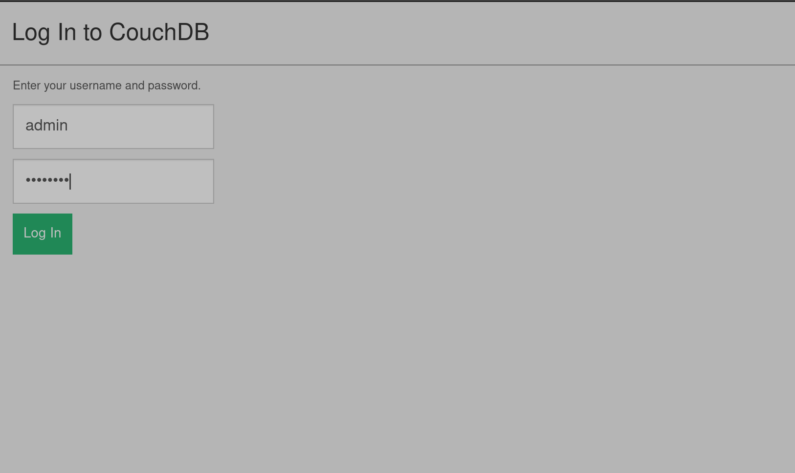
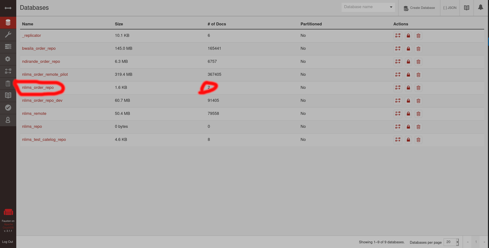

# Data Migration

Upon first installation, there may be a need to import some of the data from LIMS to
the local database. This document describes how that process should be executed. Before
proceeding make sure that everything is properly [configured](./configuration.md).

## Preparing for the migration

- Verify that the CouchDB instance is up by visiting `protocol://host:port/_utils`
  in your browser. Refer to the [configuration](./configuration.md) document for
  the protocol, host, and port.
  
    

- Attempt to login using the username and password from the configuration file.

    

- Check if the target database indeed does exist and has data in it

    
    
  Ensure that `prefix`_order_`suffix` does exist, for example for a prefix of
  nlims and a suffix of `repo` then you would be looking at the highlighted
  database. Take note of the number of docs in the docs, that's is the total
  number of records that will be processed during the migration.

- Backup the local OpenMRS database and verify if the backup is alright

NOTE: The screenshots shown here are for CouchDB 3+, your installation may look
different but the whatever has been discussed above more or less applies.

## Migration script

A migration script is provided that pulls records from CouchDB and writes them to
the local database. The migration script can be run as follows:

  ```sh
  $ rails r bin/lab/migrate.rb
  ```

The migration script will run continuosly until it finishes or an unexpected error
occurs. A lot of information is logged but it's only of use in figuring what the
script is doing as opposed to how much data has been processed. For that you may
make use of the [watch(1)](https://manpage.me/index.cgi?apropos=0&q=watch&sektion=1&manpath=CentOS+7.1&arch=default&format=html)
command. Execute it as follows:

  ```sh
  watch --interval 1 cat log/lims/migration-last-id.dat
  ```

The command above opens a screen with the number of records/docs that have so far
been processed.

  .png)

## Outputs

The script logs all its outputs to the folder `log/lims`. A number of files are
created in that folder but the most important are two:

  - migration-rejections.csv
  - migration-failures.csv
  
The first file contains all records that the script refused to attempt import.
The main reason for this refusal is that, it was unable to find a patient locally
to whom the order is to be attached to. This happens in cases where a patient in
an order does not have a a patient identifier or has a patient identifier but the
identifier does not exist in the local database. These patients will simply get
logged in the file and the migration proceeds.

The second file contains entries for orders that failed to migrate for some
reason. Reasons for the failure to migrate range from Unknown tests/specimens,
demographics not matching, to patients sharing the same identifier. Each entry
has a reason specified under the reason column. For non-matching demographics,
a diff is included in the diff column. The diff just shows what field failed
to match and lists the values that were compared.
